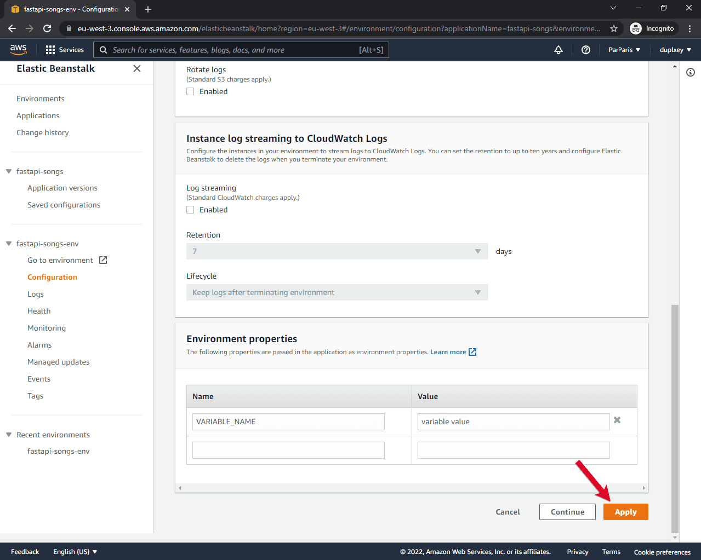

# Deploy FastAPI con Elastic Beanstalk

https://testdriven.io/blog/fastapi-elastic-beanstalk/

> autoScaling : https://docs.aws.amazon.com/elasticbeanstalk/latest/dg/using-features.managing.as.html

# Que es Elastic Beanstalk
AWS Elastic Beanstalk (EB) is an easy-to-use service for deploying and scaling web applications. It connects multiple AWS services, like compute instances (EC2), databases (RDS), load balancers (Application Load Balancer), and file storage systems (S3), to name a few. EB allows you to quickly develop and deploy your web application without thinking about the underlying infrastructure. It supports applications developed in Go, Java, .NET, Node.js, PHP, Python, and Ruby. EB also supports Docker if you need to configure your own software stack or deploy an application developed in a language (or version) that EB doesn't currently support.

# Conceptos de Elastic Beanstalk
- 1An application is a logical collection of Elastic Beanstalk components, including environments, versions, and environment configurations. An application can have multiple versions.
- An environment is a collection of AWS resources running an application version.
- A platform is a combination of an operating system, programming language runtime, web server, application server, and Elastic Beanstalk components.


# Desarrollo
## Creación de entorno y proyecto
Creamos nuestro proyecto de FastAPI con su entorno de desarrollo con ***git***
```bash
$ python3 -m virtualenv venv && source venv/bin/activate

$ pip freeze > requirements.txt
```

## Instalación de Elastic Beanstalk CLI
The AWS Elastic Beanstalk Command Line Interface (EB CLI) is a tool that helps you deploy and manage your Elastic Beanstalk applications and environments. It also provides integration with Git.

```bash
pip install awsebcli

eb --version
```
- https://pypi.org/project/awsebcli/
- https://docs.aws.amazon.com/elasticbeanstalk/latest/dg/eb-cli3.html

## Initialize Elastic Beanstalk
```bash
eb init
```

You'll be prompted with a number of questions.

### Default Region
La región donde se van a lanzar los recursos.

### Application Name
This is the name of your Elastic Beanstalk application.

### Platform and Platform Branch
The EB CLI will detect that you're using a Python environment. After that, it'll give you different Python versions and Amazon Linux versions you can work with. Pick "Python 3.8 running on 64bit Amazon Linux 2".

### CodeCommit
CodeCommit is a secure, highly scalable, managed source control service that hosts private Git repositories. We won't be using it since we're already using GitHub for source control. So say "no".

### SSH
To connect to the EC2 instances later we need to set up SSH. Say "yes" when prompted.

### Keypair
To connect to EC2 instances, we'll need an RSA keypair. Go ahead and generate one, which will be added to your "~/.ssh" folder.

After you answer all the questions, you'll notice a hidden directory inside your project root named ".elasticbeanstalk". The directory should contain a config.yml file, with all the data you've just provided.

```bash
.elasticbeanstalk
└── config.yml
```
The file should contain something similar to:

```bash
branch-defaults:
  master:
    environment: null
    group_suffix: null
global:
  application_name: fastapi-songs
  branch: null
  default_ec2_keyname: aws-eb
  default_platform: Python 3.8 running on 64bit Amazon Linux 2
  default_region: us-west-2
  include_git_submodules: true
  instance_profile: null
  platform_name: null
  platform_version: null
  profile: eb-cli
  repository: null
  sc: git
  workspace_type: Application
```

## Create Elastic Beanstalk environment
```
eb create
```
### DNS CNAME Prefix
Your web application will be accessible at  ``` %cname%.%region%.elasticbeanstalk.com``` . Again, use the default.

### Load balancer
A load balancer distributes traffic amongst your environment's instances. Select "application".

### Spot Fleet Requests
Spot Fleet requests allow you to launch instances on-demand based on your criteria. We won't be using them in this tutorial, so say "no".

## Status
Once you've deployed your app you can check its status by running:

```bash
$ eb status

Environment details for: fastapi-songs-env
  Application name: fastapi-songs
  Region: us-west-2
  Deployed Version: app-82fb-220311_171256090207
  Environment ID: e-nsizyek74z
  Platform: arn:aws:elasticbeanstalk:us-west-2::platform/Python 3.8 running on 64bit Amazon Linux 2/3.3.11
  Tier: WebServer-Standard-1.0
  CNAME: fastapi-songs-env.us-west-2.elasticbeanstalk.com
  Updated: 2022-03-11 23:16:03.822000+00:00
  Status: Launching
  Health: Red
```

## Open
```
$ eb open
```
This command will open your default browser and navigate to the CNAME domain. You'll see 502 Bad Gateway, which we'll fix here shortly.

## Console
```
$ eb console
```
This command will open the Elastic Beanstalk console in your default browser:

# Configure an Environment
In the previous step, we tried accessing our application and it returned 502 Bad Gateway. There are three reasons behind it:

- Python needs PYTHONPATH in order to find modules in our application.
- By default, Elastic Beanstalk attempts to launch the WSGI application from application.py, which doesn't exist.
- If not specified otherwise, Elastic Beanstalk tries to serve Python applications with Gunicorn. Gunicorn by itself is not compatible with FastAPI since FastAPI uses the newest ASGI standard.

## 01_fastapi.config
```yml
# .ebextensions/01_fastapi.config

option_settings:
  aws:elasticbeanstalk:application:environment:
    PYTHONPATH: "/var/app/current:$PYTHONPATH"
  aws:elasticbeanstalk:container:python:
    WSGIPath: "entrypoint:app"
  aws:elasticbeanstalk:environment:proxy:
    ProxyServer: apache
```
Notes:
- We set the PYTHONPATH to the Python path on our EC2 instance (docs).
- We changed the WSGIPath to our WSGI application (docs).

> How do EB .config files work?
> 
>- You can have as many as you want.
>- They are loaded in the following order: 01_x, 02_x, 03_x, etc.
>- You do not have to memorize these settings; you can list all your environment settings by running eb config.

## Procfile
Since FastAPI doesn't support Gunicorn by itself, we'll have to modify our web process command to use a Uvicorn worker class.
Uvicorn is the recommended ASGI web application server for FastAPI.
Create a new file called Procfile inside the project root:
```yml
web: gunicorn entrypoint:app --workers=4 --worker-class=uvicorn.workers.UvicornWorker
```


# AWS RDS Postgres
To set up Postgres for production, start by running the following command to open the AWS console:

```
$ eb console
```
Click "Configuration" on the left side bar, scroll down to "Database", and then click "Edit".

Create a DB with the following settings and click on "Apply":

- Engine: postgres
- Engine version: 12.9 (older Postgres version since db.t2.micro is not available with 13.1+)
- Instance class: db.t2.micro
- Storage: 5 GB (should be more than enough)
- Username: pick a username
- Password: pick a strong password

After the environment update is done, EB will automatically pass the following DB credentials to our FastAPI app:

```
RDS_DB_NAME
RDS_USERNAME
RDS_PASSWORD
RDS_HOSTNAME
RDS_PORT
```

# Environment Variables via EB CLI

```
$ eb setenv VARIABLE_NAME='variable value'
```

## Environment Variables via EB Console
Enter the Elastic Beanstalk console via eb open. Navigate to "Configuration" > "Software" > "Edit". Then, scroll down to the "Environment properties".



# Elastic Beanstalk CLI or Console
```
$ eb logs
```

```
$ eb logs --cloudwatch-logs enable
```


# SSH into EC2 Instance
To connect to an EC2 instance where your FastAPI application is running, run:

```
$ eb ssh
```


# Terminate EB
To remove all the AWS resources we created throughout the tutorial, first terminate the Elastic Beanstalk environment:

```
$ eb terminate
```